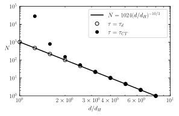

# Drop size distribution from the breakup rate

Compute the histogram of droplet sizes from the breakup rate

We follow the model of Garrett (2000), in which drops of diameter $d$ break into $m$ equally sized daughter drops. Volume conservation gives the daughter-drop diameter $d' = d / m^{1/3}$.

In steady state, the rate of drop removal equals the rate of creation:

$$
N(d'),\tau(d'),d' = m,N(d),\tau(d),d,
$$

where $\tau(d)$ is the lifetime of a drop before breakup, and $N(d)\Delta d$ is the number of drops with diameters in the range $d$ to $d+\Delta d$.

---

## Breakup lifetimes

### Inertial-range lifetime

The classical inertial-range estimate for the breakup lifetime is the eddy turnover time:

$$
\tau_d = \frac{d^{2/3}}{\epsilon^{1/3}},
$$

which applies when surface tension is negligible.

### Surface-tension–limited lifetime

The model proposed by Coulaloglou & Tavlarides (1977) and measured by Vela-Martín et al. (2022) accounts for the suppression of breakup near the Hinze scale:

$$
d_H = 0.725,\sigma^{3/5}\rho^{-3/5}\epsilon^{-2/5}.
$$

This yields an exponential breakup lifetime:

$$
\tau_{CT} =
\frac{d^{2/3}}{14.8,\epsilon^{1/3}}
\exp!\left(\frac{-7.8,\sigma}{\rho,\epsilon^{2/3} d^{5/3}}\right).
$$

---

## Iterative population balance

We begin with a single drop of size $8d_H$, which lies in the inertial range, making the subsequent cascade insensitive to the precise starting size.

At each step, the population-balance equation gives $N(d')$ from the known $N(d)$, letting us iteratively solve toward smaller drop sizes using:

* $\tau=\tau_d$ (empty circles)
* $\tau=\tau_{CT}$ (filled circles)

This corresponds physically to injecting drops of size $8d_H$ at a constant rate and letting them break up in turbulence.

---

## Resulting distributions

Both models converge to the inertial-range prediction:

$$
N(d) \sim (d/d_H)^{-10/3},
$$

because far above $d_H$ both lifetimes scale as $d^{2/3}$, guaranteeing the classical $d^{-10/3}$ steady-state drop-size distribution.

Near $d_H$, however, the Coulaloglou–Tavlarides lifetime predicts thousands of times more drops, as surface tension greatly prolongs the breakup time.

In this analysis we use binary breakups ($m=2$), but the results are insensitive to the choice of $m$ and to any prefactor multiplying the breakup rate (such as the 14.8 in $\tau_{CT}$). This robustness arises because the population balance depends only on the ratio $\tau(d)/\tau(d')$, causing such constants to cancel.

---

## Figure

---

## References

1. **C. A. Coulaloglou and L. L. Tavlarides**. “Description of Interaction Processes in Agitated Liquid-Liquid Dispersions.” *Chemical Engineering Science*, 32(11), 1289–1297 (1977). [DOI: 10.1016/0009-2509(77)85023-9](https://doi.org/10.1016/0009-2509%2877%2985023-9)

2. **Chris Garrett, Ming Li, and David Farmer**. “The Connection between Bubble Size Spectra and Energy Dissipation Rates in the Upper Ocean.” *Journal of Physical Oceanography*, 30(9), 2163–2171 (2000). [DOI: 10.1175/1520-0485(2000)030<2163:TCBBSS>2.0.CO;2](https://doi.org/10.1175/1520-0485%282000%29030%3C2163:TCBBSS%3E2.0.CO;2)

3. **Alberto Vela-Martín and Marc Avila**. “Memoryless Drop Breakup in Turbulence.” *Science Advances*, 8(50), eabp9561 (2022). [DOI: 10.1126/sciadv.abp9561](https://doi.org/10.1126/sciadv.abp9561)

